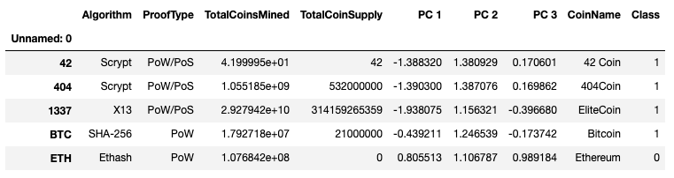
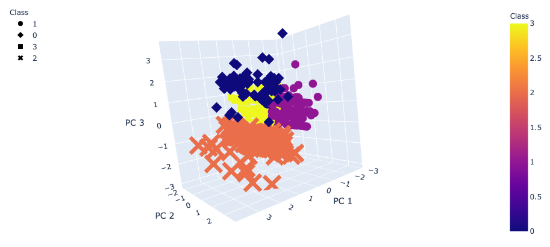

# Cryptocurrencies_MachineLearning

 

## Background
The aim of this project is to determine cryptocurrencies grouping based upon unsupervised machine learning. The project will compare clustering algorithms, such as Kmeans, Hierachical Clustering. There will also be data visualizations to share my findings.

## Objectives
The goals for this project is to:

* Prepare the data for dimensions reduction with PCA and clustering using K-means.
* Reduce data dimensions using PCA algorithms from sklearn.
* Predict clusters using cryptocurrencies data using the K-means algorithm form sklearn.
* Create some plots and data tables to present your results.

## Technologies Used
* Python
* Jupyter Notebook
* Pandas
* Sklearn (StandardScaler, PCA, AgglomerativeClustering, KMeans)
* Hvplot
* Plotly

## Processes

### Data Preprocessing
* Remove all cryptocurrencies that aren’t trading.
* Remove all cryptocurrencies that don’t have an algorithm defined.
* Remove the IsTrading column.
* Remove all cryptocurrencies with at least one null value.
* Remove all cryptocurrencies without coins mined.
* Store the names of all cryptocurrencies on a DataFramed named coins_name, and use the crypto_df.index as the index for this new DataFrame.
* Remove the CoinName column.
* Create dummies variables for all of the text features, and store the resulting data on a DataFrame named X.
* Use the StandardScaler from sklearn (Links to an external site.) to standardize all of the data from the X DataFrame. This is important prior to * using PCA and K-means algorithms.

### Reducing Data Dimensions Using PCA
* Use the PCA algorithm from sklearn (Links to an external site.) to reduce the dimensions of the X DataFrame down to three principal components.
* After reducing the data dimensions, create a DataFrame named “pcs_df” that includes the following columns: PC 1, PC 2, and PC 3. Use the crypto_df.index as the index for this new DataFrame.

### Clustering Cryptocurrencies Using K-means
* Create an elbow curve to find the best value for K, and use the pcs_df DataFrame.
* Once you define the best value for K, run the K-means algorithm to predict the K clusters for the cryptocurrencies’ data. Use the pcs_df to run the K-means algorithm.
* Create a new DataFrame named “clustered_df,” that includes the following columns: Algorithm, ProofType, TotalCoinsMined, TotalCoinSupply, PC 1, PC 2, PC 3, CoinName, and Class. Remember to maintain the index of the crypto_df DataFrames as is shown below:

### Visualizing Results
* Create a 3D scatter plot using Plotly Express to plot the clusters using the clustered_df DataFrame. Include the following parameters on the plot: hover_name="CoinName" and hover_data=["Algorithm"] to show this additional info on each data point.
* Use hvplot.table to create a data table with all the current tradable cryptocurrencies. The table should have the following columns: CoinName, Algorithm, ProofType, TotalCoinSupply, TotalCoinsMined, and Class.
* Create a scatter plot using hvplot.scatter to present the clustered data about cryptocurrencies having x="TotalCoinsMined" and y="TotalCoinSupply" to contrast the number of available coins versus the total number of mined coins. Use the hover_cols=["CoinName"] parameter to include the cryptocurrency name on each data point.

